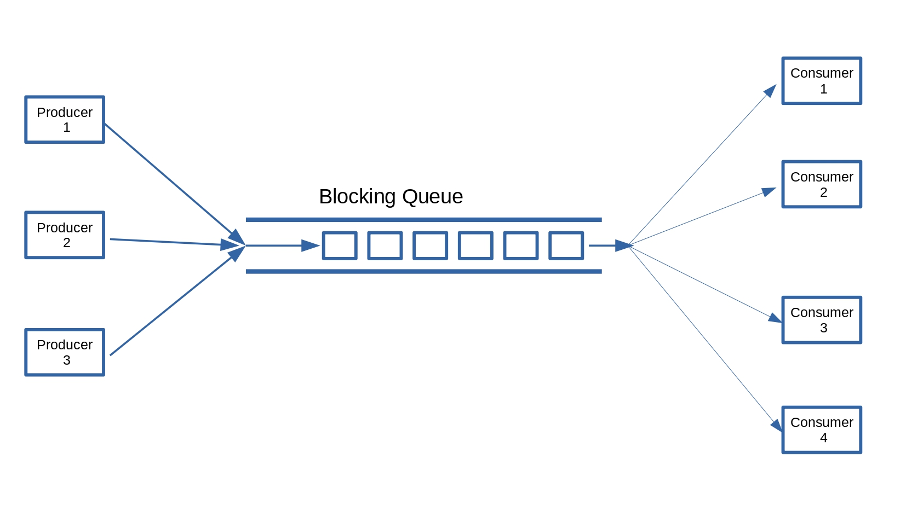

# Esempi Produttore-Consumatore

## versione 1
La classe del contenitore [produttoreconsumatore.v1.MessageBox](./src/produttoreconsumatore/v1/MessageBox.java) degli oggetti passati tra 
produttore e consumatore tramite i metodi `void addContenuto(int contenuto)` e `int getContenuto()` di `MessageBox`,
il thread [produttoreconsumatore.v1.Produttore](./src/produttoreconsumatore/v1/Produttore.java),
il thread [produttoreconsumatore.v1.Consumatore](./src/produttoreconsumatore/v1/Consumatore.java), 
e applicazione 
[produttoreconsumatore.v1.TestProduttoreConsumatore](./src/produttoreconsumatore/v1/TestProduttoreConsumatore.java).

**QUESTA VERSIONE NON E' CORRETTA PER RISOLVERE IL PROBLEMA DEL PRODUTTORE/CONSUMATORE**.

## versione 2
La classe del contenitore [produttoreconsumatore.v2.MessageBox](./src/produttoreconsumatore/v2/MessageBox.java) 
unica differenza con sincronizzazione dei metodi `void addContenuto(int contenuto)` e `int getContenuto()`. 

**ANCHE QUESTA VERSIONE NON E' CORRETTA PER RISOLVERE IL PROBLEMA DEL PRODUTTORE/CONSUMATORE**.

## versione 3 - Produttore/Consumatore
La classe del contenitore [produttoreconsumatore.v3.MessageBox](./src/produttoreconsumatore/v3/MessageBox.java) con utilizzo di **wait()** e **notify()**,
il thread [produttoreconsumatore.v3.Produttore](./src/produttoreconsumatore/v3/Produttore.java),
il thread [produttoreconsumatore.v3.Consumatore](./src/produttoreconsumatore/v3/Consumatore.java),
e applicazione
[produttoreconsumatore.v3.TestProduttoreConsumatore](./src/produttoreconsumatore/v3/TestProduttoreConsumatore.java).

## versione 4 - Più produttori/Più consumatori
La classe del contenitore [produttoreconsumatore.v4.MessageBox](./src/produttoreconsumatore/v4/MessageBox.java) con utilizzo di **wait()** e **notifyAll()**,
[produttoreconsumatore.v4.Incrementer](./src/produttoreconsumatore/v4/Incrementer.java) per avere un generatore **safe** di numeri progressivi,
il thread [produttoreconsumatore.v4.Produttore](./src/produttoreconsumatore/v4/Produttore.java),
il thread [produttoreconsumatore.v4.Consumatore](./src/produttoreconsumatore/v4/Consumatore.java),
e applicazione
[produttoreconsumatore.v4.TestProduttoreConsumatoreMulti](./src/produttoreconsumatore/v4/TestProduttoreConsumatoreMulti.java).

NOTETE CHE MessageBox per gestire correttamente il problema di avere più produttori e più consumatori
contemporaneamente, utilizza **notifyAll()** invece del semplice **notify()**.

## versione 5 - Buffer con capacità massima - coda bloccante

La classe coda bloccante [produttoreconsumatore.v5.BlockingQueue](./src/produttoreconsumatore/v5/BlockingQueue.java) implementa una coda FIFO in cui più produttori e più consumatori possono inserire e prelevare dalla coda,
[produttoreconsumatore.v5.Incrementer](./src/produttoreconsumatore/v5/Incrementer.java) per avere un generatore **safe** di numeri progressivi,
il thread produttore [produttoreconsumatore.v5.Produttore](./src/produttoreconsumatore/v5/Produttore.java),
il thread consumatore [produttoreconsumatore.v5.Consumatore](./src/produttoreconsumatore/v5/Consumatore.java),
e l'applicazione
[produttoreconsumatore.v5.TestProduttoreConsumatoreMulti](./src/produttoreconsumatore/v5/TestProduttoreConsumatoreMulti.java).

## Utilizzo della BlockingQueue di Java

Istanziazione di una `BlockingQueue` di tipo `ArrayBlockingQueue` di capacity 6.

```java

BlockingQueue<Integer> queue = new ArrayBlockingQueue<>(6);

```
Il thread produttore e quello consumatore per comunicare condividono un 
oggetto di tipo `BlockingQueue<E>`.

Il thread produttore [produttoreconsumatore.v6.Produttore](./src/produttoreconsumatore/v6/Produttore.java),
il thread consumatore [produttoreconsumatore.v6.Consumatore](./src/produttoreconsumatore/v6/Consumatore.java),
e l'applicazione
[produttoreconsumatore.v6.TestProduttoreConsumatoreMulti](./src/produttoreconsumatore/v6/TestProduttoreConsumatoreMulti.java).


Classi code bloccanti della *Standard Java library*:

Interfaccia [java.util.concurrent.BlockingQueue<E>](https://docs.oracle.com/javase/7/docs/api/java/util/concurrent/BlockingQueue.html)

[java.util.concurrent.ArrayBlockingQueue<E>](https://docs.oracle.com/javase/7/docs/api/java/util/concurrent/ArrayBlockingQueue.html)

[java.util.concurrent.LinkedBlockingQueue<E>](https://docs.oracle.com/javase/7/docs/api/java/util/concurrent/LinkedBlockingQueue.html)

Vedi: https://checksound.gitbook.io/corsojava/i-thread-e-concorrenza/wait-notify-e-notifyall-per-la-sincronizzazione-tra-i-thread


