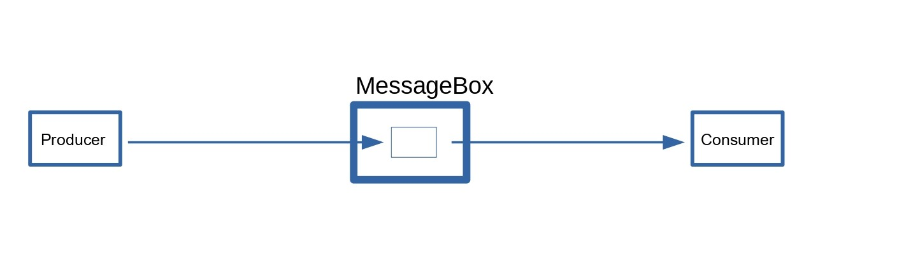
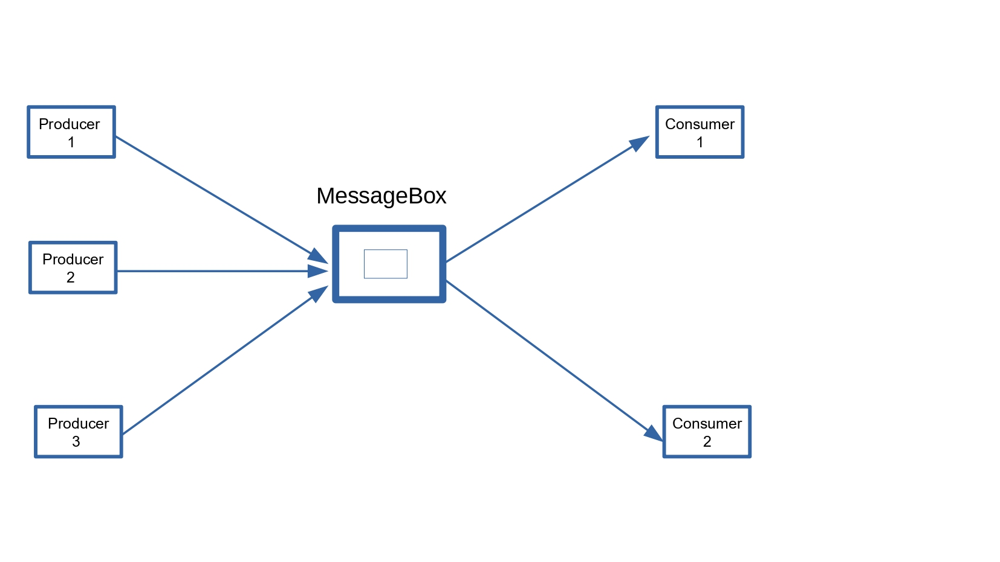

# Esempi Produttore-Consumatore

Il problema di avere uno o più produttori e uno o più consumatori 
che comunicano tramite una variabile condivisa. 


 
## versione 1 - Un produttore e un consumatore
La classe del contenitore [produttoreconsumatore.v1.MessageBox](./src/produttoreconsumatore/v1/MessageBox.java) degli oggetti passati tra 
produttore e consumatore tramite i metodi `void addContenuto(int contenuto)` e `int getContenuto()` di `MessageBox`,
il thread [produttoreconsumatore.v1.Produttore](./src/produttoreconsumatore/v1/Produttore.java),
il thread [produttoreconsumatore.v1.Consumatore](./src/produttoreconsumatore/v1/Consumatore.java), 
e applicazione 
[produttoreconsumatore.v1.TestProduttoreConsumatore](./src/produttoreconsumatore/v1/TestProduttoreConsumatore.java).

Un output di una esecuzione: 

```

PUT >>>>: 0
PUT >>>>: 1
PUT >>>>: 2
PUT >>>>: 3
PUT >>>>: 4
PUT >>>>: 5
PUT >>>>: 6
PUT >>>>: 7
GET <<<<<: 0
GET <<<<<: 7
GET <<<<<: 7
GET <<<<<: 7
PUT >>>>: 8
PUT >>>>: 9
GET <<<<<: 7
GET <<<<<: 9
GET <<<<<: 9
GET <<<<<: 9
GET <<<<<: 9
GET <<<<<: 9

```

**QUESTA VERSIONE NON E' CORRETTA PER RISOLVERE IL PROBLEMA DEL PRODUTTORE/CONSUMATORE**.

## versione 2 - Un produttore e un consumatore
La classe del contenitore [produttoreconsumatore.v2.MessageBox](./src/produttoreconsumatore/v2/MessageBox.java) 
unica differenza con sincronizzazione dei metodi `void addContenuto(int contenuto)` e `int getContenuto()`. 

Un output di una esecuzione:

```

GET <<<<<: 0
GET <<<<<: 0
GET <<<<<: 0
GET <<<<<: 0
PUT >>>>: 0
GET <<<<<: 0
GET <<<<<: 0
GET <<<<<: 0
GET <<<<<: 0
GET <<<<<: 0
GET <<<<<: 0
PUT >>>>: 1
PUT >>>>: 2
PUT >>>>: 3
PUT >>>>: 4
PUT >>>>: 5
PUT >>>>: 6
PUT >>>>: 7
PUT >>>>: 8
PUT >>>>: 9

```

**ANCHE QUESTA VERSIONE NON E' CORRETTA PER RISOLVERE IL PROBLEMA DEL PRODUTTORE/CONSUMATORE**.

## versione 3 - Produttore/Consumatore
La classe del contenitore [produttoreconsumatore.v3.MessageBox](./src/produttoreconsumatore/v3/MessageBox.java) con utilizzo di **wait()** e **notify()**,
il thread [produttoreconsumatore.v3.Produttore](./src/produttoreconsumatore/v3/Produttore.java),
il thread [produttoreconsumatore.v3.Consumatore](./src/produttoreconsumatore/v3/Consumatore.java),
e applicazione
[produttoreconsumatore.v3.TestProduttoreConsumatore](./src/produttoreconsumatore/v3/TestProduttoreConsumatore.java).

L'output di una esecuzione:

```

PUT >>>>: 0
GET <<<<<: 0
PUT >>>>: 1
GET <<<<<: 1
PUT >>>>: 2
GET <<<<<: 2
PUT >>>>: 3
GET <<<<<: 3
PUT >>>>: 4
GET <<<<<: 4
PUT >>>>: 5
GET <<<<<: 5
PUT >>>>: 6
GET <<<<<: 6
PUT >>>>: 7
GET <<<<<: 7
PUT >>>>: 8
GET <<<<<: 8
PUT >>>>: 9
GET <<<<<: 9

```

Ora il produttore e il consumatore si alternano in modo corretto-

## versione 4 - Più produttori/Più consumatori



La classe del contenitore [produttoreconsumatore.v4.MessageBox](./src/produttoreconsumatore/v4/MessageBox.java) con utilizzo di **wait()** e **notifyAll()**,
[produttoreconsumatore.v4.Incrementer](./src/produttoreconsumatore/v4/Incrementer.java) per avere un generatore **safe** di numeri progressivi,
il thread [produttoreconsumatore.v4.Produttore](./src/produttoreconsumatore/v4/Produttore.java),
il thread [produttoreconsumatore.v4.Consumatore](./src/produttoreconsumatore/v4/Consumatore.java),
e applicazione
[produttoreconsumatore.v4.TestProduttoreConsumatoreMulti](./src/produttoreconsumatore/v4/TestProduttoreConsumatoreMulti.java).

l'output adi una esecuzione: 

```

produttore_2 - PUT >>>>: 0
consumatore_3 - GET <<<<<: 0
produttore_3 - PUT >>>>: 2
consumatore_1 - GET <<<<<: 2
produttore_1 - PUT >>>>: 1
consumatore_2 - GET <<<<<: 1
produttore_2 - PUT >>>>: 3
consumatore_3 - GET <<<<<: 3
produttore_3 - PUT >>>>: 4
consumatore_1 - GET <<<<<: 4
produttore_1 - PUT >>>>: 5
consumatore_2 - GET <<<<<: 5
produttore_2 - PUT >>>>: 6
consumatore_1 - GET <<<<<: 6
produttore_2 - PUT >>>>: 9
consumatore_2 - GET <<<<<: 9
produttore_3 - PUT >>>>: 7
consumatore_3 - GET <<<<<: 7
produttore_1 - PUT >>>>: 8
consumatore_2 - GET <<<<<: 8
produttore_3 - PUT >>>>: 10
consumatore_1 - GET <<<<<: 10
produttore_2 - PUT >>>>: 11
consumatore_3 - GET <<<<<: 11
produttore_1 - PUT >>>>: 12
consumatore_2 - GET <<<<<: 12
produttore_3 - PUT >>>>: 13
consumatore_3 - GET <<<<<: 13
produttore_1 - PUT >>>>: 14
consumatore_1 - GET <<<<<: 14

```

**NOTATE CHE** `MessageBox` per gestire correttamente il problema di avere più produttori e più consumatori
contemporaneamente, utilizza **notifyAll()** invece del semplice **notify()**.

## versione 5 - Buffer con capacità massima - coda bloccante

La classe coda bloccante [produttoreconsumatore.v5.BlockingQueue](./src/produttoreconsumatore/v5/BlockingQueue.java) implementa una coda FIFO in cui più produttori e più consumatori possono inserire e prelevare dalla coda,
[produttoreconsumatore.v5.Incrementer](./src/produttoreconsumatore/v5/Incrementer.java) per avere un generatore **safe** di numeri progressivi,
il thread produttore [produttoreconsumatore.v5.Produttore](./src/produttoreconsumatore/v5/Produttore.java),
il thread consumatore [produttoreconsumatore.v5.Consumatore](./src/produttoreconsumatore/v5/Consumatore.java),
e l'applicazione
[produttoreconsumatore.v5.TestProduttoreConsumatoreMulti](./src/produttoreconsumatore/v5/TestProduttoreConsumatoreMulti.java).

L'output di una esecuzione: 

```

produttore_1 - PUT >>>>: 0
consumatore_3 - GET <<<<<: 0
produttore_3 - PUT >>>>: 2
consumatore_1 - GET <<<<<: 2
produttore_2 - PUT >>>>: 1
consumatore_2 - GET <<<<<: 1
produttore_1 - PUT >>>>: 3
produttore_3 - PUT >>>>: 4
produttore_2 - PUT >>>>: 5
produttore_1 - PUT >>>>: 6
produttore_3 - PUT >>>>: 7
produttore_2 - PUT >>>>: 8
consumatore_3 - GET <<<<<: 3
produttore_3 - PUT >>>>: 9
consumatore_1 - GET <<<<<: 4
produttore_1 - PUT >>>>: 11
consumatore_2 - GET <<<<<: 5
produttore_2 - PUT >>>>: 10
consumatore_3 - GET <<<<<: 6
produttore_1 - PUT >>>>: 13
consumatore_1 - GET <<<<<: 7
produttore_2 - PUT >>>>: 14
consumatore_2 - GET <<<<<: 8
produttore_3 - PUT >>>>: 12
consumatore_1 - GET <<<<<: 9
produttore_1 - PUT >>>>: 16
consumatore_3 - GET <<<<<: 11
produttore_3 - PUT >>>>: 17
consumatore_2 - GET <<<<<: 10
produttore_2 - PUT >>>>: 15
consumatore_1 - GET <<<<<: 13
produttore_1 - PUT >>>>: 19
consumatore_3 - GET <<<<<: 14
produttore_2 - PUT >>>>: 20
consumatore_2 - GET <<<<<: 12
produttore_3 - PUT >>>>: 18
consumatore_3 - GET <<<<<: 16
produttore_1 - PUT >>>>: 22
consumatore_1 - GET <<<<<: 17
produttore_3 - PUT >>>>: 23
consumatore_2 - GET <<<<<: 15
produttore_2 - PUT >>>>: 21
consumatore_1 - GET <<<<<: 19
produttore_1 - PUT >>>>: 25
consumatore_3 - GET <<<<<: 20
produttore_2 - PUT >>>>: 26
consumatore_2 - GET <<<<<: 18
produttore_3 - PUT >>>>: 24
consumatore_1 - GET <<<<<: 22
produttore_1 - PUT >>>>: 28
consumatore_3 - GET <<<<<: 23
produttore_3 - PUT >>>>: 29
consumatore_2 - GET <<<<<: 21
produttore_2 - PUT >>>>: 27
consumatore_3 - GET <<<<<: 25
consumatore_1 - GET <<<<<: 26
consumatore_2 - GET <<<<<: 24
consumatore_3 - GET <<<<<: 28
consumatore_1 - GET <<<<<: 29
consumatore_2 - GET <<<<<: 27

```

## Utilizzo della BlockingQueue di Java

Istanziazione di una `BlockingQueue` di tipo `ArrayBlockingQueue` di capacity 6.

```java

BlockingQueue<Integer> queue = new ArrayBlockingQueue<>(6);

```
Il thread produttore e quello consumatore per comunicare condividono un 
oggetto di tipo `BlockingQueue<E>`.

Il thread produttore [produttoreconsumatore.v6.Produttore](./src/produttoreconsumatore/v6/Produttore.java),
il thread consumatore [produttoreconsumatore.v6.Consumatore](./src/produttoreconsumatore/v6/Consumatore.java),
e l'applicazione
[produttoreconsumatore.v6.TestProduttoreConsumatoreMulti](./src/produttoreconsumatore/v6/TestProduttoreConsumatoreMulti.java).


Classi code bloccanti della *Standard Java library*:

Interfaccia [java.util.concurrent.BlockingQueue\<E>](https://docs.oracle.com/javase/7/docs/api/java/util/concurrent/BlockingQueue.html) e
implementazioni: 
[java.util.concurrent.ArrayBlockingQueue\<E>](https://docs.oracle.com/javase/7/docs/api/java/util/concurrent/ArrayBlockingQueue.html) 
[java.util.concurrent.LinkedBlockingQueue\<E>](https://docs.oracle.com/javase/7/docs/api/java/util/concurrent/LinkedBlockingQueue.html) 

L'output di una esecuzione: 

```

produttore_2 - PUT >>>>: 1
produttore_3 - PUT >>>>: 2
produttore_1 - PUT >>>>: 0
consumatore_3 - TAKEN <<<<<: 0
consumatore_2 - TAKEN <<<<<: 2
consumatore_1 - TAKEN <<<<<: 1
produttore_1 - PUT >>>>: 4
produttore_3 - PUT >>>>: 5
produttore_2 - PUT >>>>: 3
produttore_2 - PUT >>>>: 6
produttore_3 - PUT >>>>: 7
produttore_1 - PUT >>>>: 8
produttore_2 - PUT >>>>: 11
produttore_3 - PUT >>>>: 10
produttore_1 - PUT >>>>: 9
consumatore_2 - TAKEN <<<<<: 5
consumatore_3 - TAKEN <<<<<: 4
consumatore_1 - TAKEN <<<<<: 3
produttore_1 - PUT >>>>: 13
produttore_3 - PUT >>>>: 12
produttore_2 - PUT >>>>: 14
consumatore_1 - TAKEN <<<<<: 7
consumatore_2 - TAKEN <<<<<: 8
consumatore_3 - TAKEN <<<<<: 6
produttore_1 - PUT >>>>: 17
produttore_2 - PUT >>>>: 16
produttore_3 - PUT >>>>: 15
consumatore_1 - TAKEN <<<<<: 9
consumatore_3 - TAKEN <<<<<: 11
consumatore_2 - TAKEN <<<<<: 10
produttore_1 - PUT >>>>: 19
produttore_2 - PUT >>>>: 20
produttore_3 - PUT >>>>: 18
consumatore_3 - TAKEN <<<<<: 13
consumatore_2 - TAKEN <<<<<: 14
consumatore_1 - TAKEN <<<<<: 12
produttore_3 - PUT >>>>: 22
produttore_2 - PUT >>>>: 21
produttore_1 - PUT >>>>: 23
consumatore_3 - TAKEN <<<<<: 17
consumatore_1 - TAKEN <<<<<: 16
consumatore_2 - TAKEN <<<<<: 15
produttore_1 - PUT >>>>: 25
produttore_3 - PUT >>>>: 26
produttore_2 - PUT >>>>: 24
consumatore_3 - TAKEN <<<<<: 20
consumatore_2 - TAKEN <<<<<: 19
consumatore_1 - TAKEN <<<<<: 18
produttore_2 - PUT >>>>: 27
produttore_3 - PUT >>>>: 28
produttore_1 - PUT >>>>: 29
consumatore_1 - TAKEN <<<<<: 21
consumatore_2 - TAKEN <<<<<: 23
consumatore_3 - TAKEN <<<<<: 22
consumatore_3 - TAKEN <<<<<: 25
consumatore_1 - TAKEN <<<<<: 24
consumatore_2 - TAKEN <<<<<: 26
consumatore_3 - TAKEN <<<<<: 27
consumatore_2 - TAKEN <<<<<: 28
consumatore_1 - TAKEN <<<<<: 29

```

Vedi teoria: https://checksound.gitbook.io/corsojava/i-thread-e-concorrenza/wait-notify-e-notifyall-per-la-sincronizzazione-tra-i-thread


